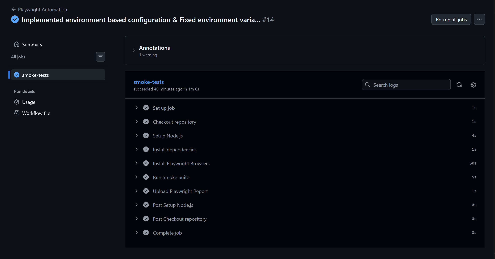
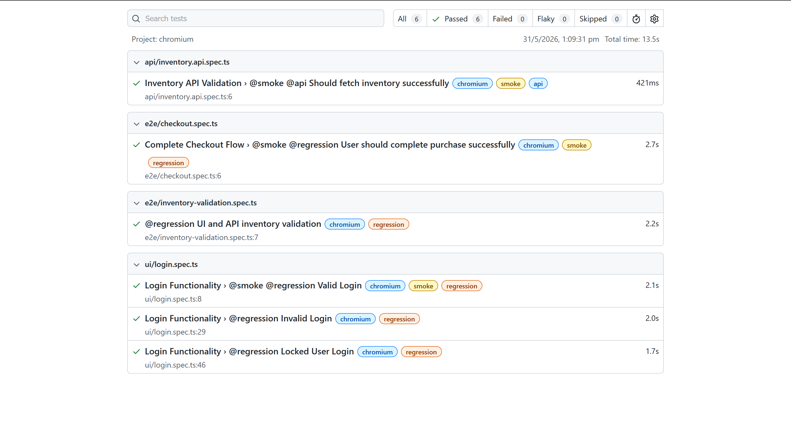
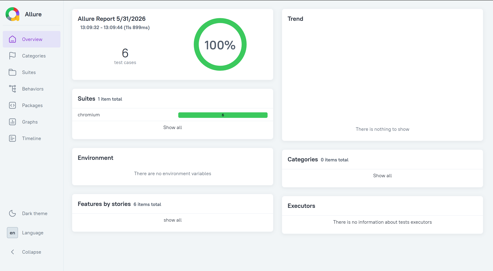
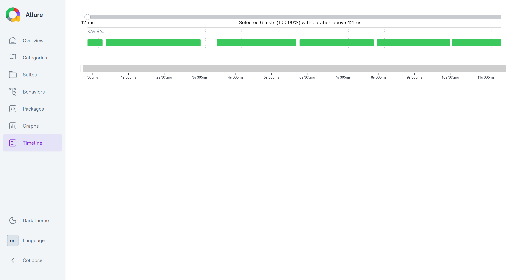

# 🚀 Enterprise QE Playwright Framework

[](https://github.com/Kavi1202/enterprise-qe-playwright-framework/actions/workflows/playwright.yml)

Production-style Quality Engineering automation framework built using Playwright, TypeScript, API testing, CI/CD, Page Object Model (POM), reusable fixtures, assertions, and cross-browser execution.


## 📌 Features

- ✅ UI Automation using Playwright
- ✅ API Testing
- ✅ End-to-End Checkout Flow
- ✅ Page Object Model (POM)
- ✅ Reusable Fixtures
- ✅ Assertion Layer
- ✅ Data-Driven Testing
- ✅ Smoke & Regression Tagging
- ✅ GitHub Actions CI/CD
- ✅ Cross Browser Execution
- ✅ HTML Reporting


## 🛠️ Tech Stack

| Tool | Purpose |
|------|----------|
| Playwright | UI Automation |
| TypeScript | Programming Language |
| GitHub Actions | CI/CD |
| REST API | API Validation |
| JSON | Test Data Management |

## 🎯 Framework Design Principle

This framework was designed following Quality Engineering best practices with emphasis on maintainability, scalability, and reusability.

### Key Design Decisions

- Page Object Model (POM) for separation of concerns and maintainable locator management.
- Reusable Fixtures to eliminate repeated setup logic and improve scalability.
- Assertion Layer for centralized validation and easier maintenance.
- Data-Driven Testing using external JSON test data.
- Tag-based Execution (@smoke, @regression) for selective CI execution.
- API + UI Validation to validate backend responses alongside frontend rendering.
- CI/CD Integration using GitHub Actions for automated smoke execution.
- Cross-Browser Testing across Chromium, Firefox, and WebKit.

### Why this Architecture?

The framework is intentionally structured to simulate a production-style Quality Engineering setup, where tests remain modular, maintainable, and scalable as the application grows.

## 📂 Project Structure

```text
enterprise-qe-playwright-framework
│
├── assertions/
├── fixtures/
├── pages/
├── test-data/
├── tests/
│   ├── api/
│   ├── e2e/
│   └── ui/
├── utils/
├── playwright.config.ts
├── package.json
└── README.md
```

## 🏗️ Framework Architecture
```
Tests 
   ↓ 
Fixtures 
   ↓ 
Page Objects 
   ↓ 
Utilities 
   ↓ 
Assertions 
   ↓ 
Reports / CI
```
## ▶️ Running Tests

To run tests, run the following command

### Run Smoke Suite

```bash
npm run smoke
```

### Run Regression Suite

```bash
npm run regression
```

### Run API Tests

```bash
npm run api
```

### Run All Tests

```bash
npx playwright test
```


## 📊 Reports

Generate HTML Report:


```bash
npm run report
```
Playwright automatically generates execution reports for easier debugging and analysis.
## 🔥Key Automation Scenario

### UI Testing
- Login validation
- Invalid login validation
- Locked user validation

### E2E Testing
- Complete checkout flow
- Cart validation
- Inventory validation

### API Testing
- Product API validation
- UI + API integration validation

## 📸Execution Reports

#### GitHub Actions CI Pipeline



#### Playwright HTML Report



## 📊 Allure Reports

### Dashboard



### Timeline


## ⚙️ CI/CD Integration

Integrated with **GitHub Actions** for automated smoke execution on every push and pull request.

#### Workflow Includes:
- Dependency installation
- Playwright browser installation
- Smoke test execution
- Report artifact upload
- Automated validation for pull requests

## 🤖 GenAI for Testing

Implemented GenAI-assisted utilities for:

- Test Case Generation
- Exploratory Test Design
- Risk Identification
- Edge Case Discovery

These utilities help accelerate test planning and improve test coverage during requirement analysis.
## 🚀 Future Enhancement

- Dockerized Playwright execution
- Environment-based configuration (QA, Stage, Prod)
- Database validation layer
- Allure reporting integration
- Parallel execution optimization
- Contract/API schema validation
- Slack/Teams CI notifications
## 👨‍💻 Authors
**Kaviraj P**

Aspiring Quality Engineer focused on:
- Playwright Automation
- QE Framework Design
- API Testing
- GenAI for Testing
- CI/CD Integration

## ⭐ Contribution

This project was created to demonstrate modern Quality Engineering automation practices, scalable Playwright framework design, and CI/CD integration.

